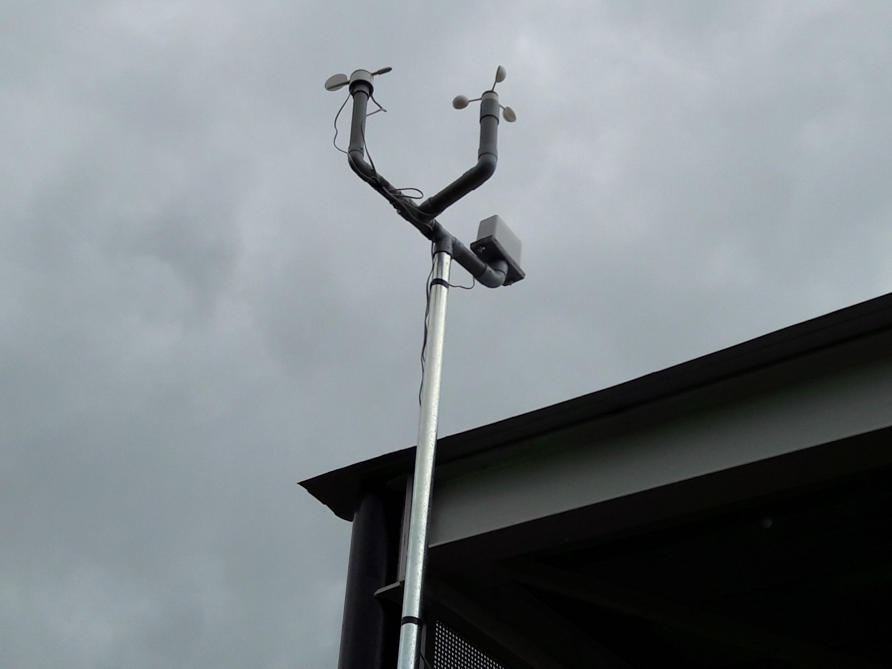
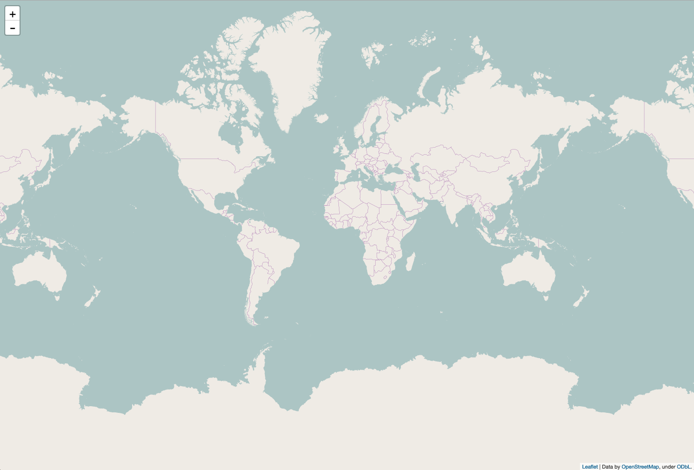

# Mapping the Weather

One thousand Weather Stations were sent out to schools all over the world at the beginning of 2016, ready to be assembled and begin collecting global weather data.



Each Weather Station comes equipped with the sensors shown in the table below:

|Sensor Name|Purpose|
|-----------|-------|
|Rain gauge|Measures the volume of rain falling in millimetres|
|Anemometer|Measures the wind speed in kilometres per hour|
|Wind vane|Measures the wind direction in degrees|
|Soil temperature probe|Measures the soil temperature in degrees Celsius|
|Temperature sensor|Measures the air temperature in degrees Celsius|
|Humidity sensor|Measures the relative humidity of the air as a percentage|
|Pressure sensor|Measures the atmospheric pressure in Pascals
|Air quality sensor|Measures the air quality as a relative percentage|

The Weather Stations continually monitor the weather and then send their data to an Oracle database, where it is stored and from which it can be accessed.

In this resource you're first going to fetch a list of the online Weather Stations, and then plot them onto a map of the world.

You can then look at gathering some data from all the available Weather Stations and plotting that weather data to the map.


## Fetching the weather stations

For greater detail on using JSON and the RESTful API of the Raspberry Pi Weather Station database, you can have a look over the resources - [Fetching the Weather](https://www.raspberrypi.org/learning/fetching-the-weather/) and [Graphing the Weather](https://www.raspberrypi.org/learning/graphing-the-weather/).

1. This guide is written for a Raspberry Pi, but the code should also work on any computer that has Python3 installed. You can find out more about installing Python on differnet types of computer [here](https://wiki.python.org/moin/BeginnersGuide).

1. Open a new Python shell by clicking on **Menu** > **Programming** > **Python 3 (IDLE)**. Then click **File** > **New File** to start a new script.

1. To begin with you'll need to import a Python module. If you haven't installed it yet, you can find details on the [requirements page](https://www.raspberrypi.org/learning/mapping-the-weather/requirements).


    ``` python
    from requests import get
    import json
    import folium
    import os
    import webbrowser
    import html
    ```

1. Here, `requests` is used to fetch the json data from the database, `json` is used to process JSON data. `folium` is a tool for visualising data on maps in Python.

1. Next, the URL for the RESTful API needs to be stored as a string in your program.

    ``` python
    url = 'https://apex.oracle.com/pls/apex/raspberrypi/weatherstation/getallstations'
    ```

1. The JSON data can then be fetched.

    ``` python
    stations = get(url).json()
    ```

1. Save and run this file to fetch the data. You can examine the data by typing the following into the Python shell:

    ``` python
    stations['items'][0]
    ```

1. You should see something like this printed out in the shell:


    ``` python
    {'weather_stn_name': 'Pi Towers Demo', 'weather_stn_id': 255541, 'weather_stn_long': 0.110421, 'weather_stn_lat': 52.213842}
    ```

1. This is the first record in the JSON data. As you can see, the station's longitude and latitude are within the dictionary. If you want to learn a little more about longitudes and latitudes, then have a look at the [second worksheet from Fetching the Weather](https://www.raspberrypi.org/learning/fetching-the-weather/worksheet2) These are easy enough to access. For instance, you could type this into the shell:


    ``` python
    stations['items'][0]['weather_stn_long']
    ```

    If you wanted to see a different station, you could type this:


    ``` python
    stations['items'][5]['weather_stn_long']
    ```

1. Three list comprehensions can be used in your Python file to fetch all the longitude and latitude values along with the names of the weather stations. These iterate over the JSON data and extract each of the longitudes, latitudes and names and place them in separate lists. When school's register their weather stations, they can use characters that may cause problems when used within HTML tags, so we need to *escape* this string to make sureour final map page loads and displays correctly.  

    ``` python
    lons = [station['weather_stn_long'] for station in stations['items']]
    lats = [station['weather_stn_lat'] for station in stations['items']]
    wsnames = [html.escape(station['weather_stn_name'] ) for station in stations['items']]
    ```

1. You can run your file now; you can have a look at all the weather station names by typing the following in the shell:

``` python
wsnames
```

## Creating a map


1. The first thing to do is to set up your map.

    ``` python
    map_ws = folium.Map(location=[0,0],zoom_start=2)
    ```

1. This creates a map with centred at latitude 0, longitude 0.

1. Finally you need to save your map into a local html file and then open it using a web-browser. Python's `os` library is used to discover the Current Working Directory (CWD) so that the web-browser knows from where to load the saved map file

    ``` python
    CWD = os.getcwd()
    map_ws.save('wsmap1.html')
    webbrowser.open_new('file://'+CWD+'/'+'wsmap1.html')
    ```

1. Save and run your file, and a new browser window should open up, displaying a map of the globe.




## Plotting stations

1. Now that you have the map, the way you like it, you can add all the locations of the Weather Stations. These lines need to go **before** the `map_ws.save` line. If you click on a marker, it should show the name of the Weather Station.


    ``` python
    for n in range(len(lons)):
        folium.Marker([lats[n],
                    lons[n]],
                    popup = wsnames[n]).add_to(map_ws)
    ```

    

1. You can also alter the colour and style of your markers by changing the `folium.Marker` options:

    ``` python
    for n in range(len(lons)):
    	folium.Marker([lats[n],
                   lons[n]],
                   icon = folium.Icon(icon = 'cloud', color = 'green'),
                   popup = wsnames[n]).add_to(map_ws)
    ```

1. Lastly, if you want to focus on a specific part of the map, you can set the longitude and latitude and the zoom level by adjusting the `map_ws` options. Here the map is centred on the UK.

``` python
map_ws = folium.Map(location=[54,-2], zoom_start=6)
```


## What Next

Move on to [worksheet two](worksheet2.md) to learn how to plot weather data on your map.
