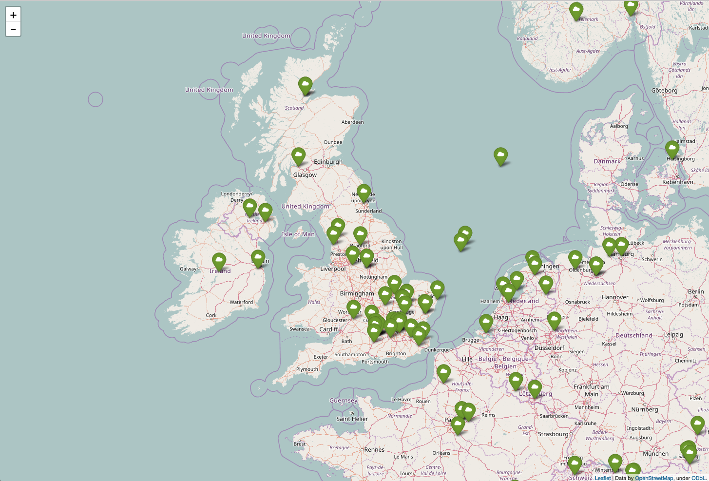

# Mapping the Weather

One thousand weather stations were sent out to schools all over the world at the beginning of 2016, ready to be assembled and begin collecting global weather data.


Each weather station comes equipped with the sensors listed in the table below:

|Sensor name|Purpose - What does it measure?|
|-----------|-------|
|Rain gauge|Volume of rain falling in millimetres|
|Anemometer|Wind speed in kilometres per hour|
|Wind vane|Wind direction in degrees|
|Soil temperature probe|Soil temperature in degrees Celsius|
|Temperature sensor|Air temperature in degrees Celsius|
|Humidity sensor|Relative humidity of the air as a percentage|
|Pressure sensor|Atmospheric pressure in Pascals
|Air quality sensor|Air quality as a relative percentage|

The weather stations continually monitor the environment and send their data to an Oracle database, where it is stored and from which it can be accessed.

In this resource you're first going to fetch a list of online weather stations, and then plot them onto a map of the world.

You can then look at gathering data from all the available weather stations and plotting that weather data to the map.


## Fetching the weather stations

If you want to know more about using JSON and the RESTful API of the Raspberry Pi weather station database, have a look over the resources [Fetching the weather](https://www.raspberrypi.org/learning/fetching-the-weather/) and [Graphing the weather](https://www.raspberrypi.org/learning/graphing-the-weather/).

1. This guide is written for a Raspberry Pi, but the code should work on any computer that has Python 3 installed. You can find out more about installing Python on differnet types of computers [here](https://wiki.python.org/moin/BeginnersGuide).

1. Open a new Python shell by clicking on **Menu** > **Programming** > **Python 3 (IDLE)**. Then click **File** > **New File** to start a new script.

1. To begin, you'll need to import a Python module. If you haven't installed it yet, you can find details on the [requirements page](https://www.raspberrypi.org/learning/mapping-the-weather/requirements).


    ``` python
    from requests import get
    import json
    import folium
    import os
    import webbrowser
    import html
    ```

1. Here, `requests` is used to fetch the JSON data from the database, and `json` to process JSON data. `folium` is a tool for visualising data on maps in Python.

1. Next, the URL for the RESTful API needs to be stored as a string in your program.

    ``` python
    url = 'https://apex.oracle.com/pls/apex/raspberrypi/weatherstation/getallstations'
    ```

1. Then, the JSON data can be fetched.

    ``` python
    stations = get(url).json()
    ```

1. Save and run this file to fetch the data. You will be able to examine the data, for example by typing the following into the Python shell:

    ``` python
    stations['items'][0]
    ```

1. You should see something like this printed out in the shell:


    ``` python
    {'weather_stn_name': 'Pi Towers Demo', 'weather_stn_id': 255541, 'weather_stn_long': 0.110421, 'weather_stn_lat': 52.213842}
    ```

1. This is the first record in the JSON data set. As you can see, the station's longitude and latitude are within the dictionary. If you want to learn a little more about longitudes and latitudes, have a look at the [second worksheet of this resource](https://www.raspberrypi.org/learning/fetching-the-weather/worksheet2). The longitude and latitude values are easy to access. For instance, to find out the longitude of the first station in the dictionary, type this into the shell:


    ``` python
    stations['items'][0]['weather_stn_long']
    ```

    If you wanted to see the value of a different station, type this:


    ``` python
    stations['items'][5]['weather_stn_long']
    ```


1. Add three list comprehensions to your Python file to fetch all the longitude and latitude values along with the names of the weather stations. These commands iterate over the JSON data and extract each of the longitudes, latitudes, and names and place them in separate lists.

    ``` python
    lons = [station['weather_stn_long'] for station in stations['items']]
    lats = [station['weather_stn_lat'] for station in stations['items']]
    wsnames = [html.escape(station['weather_stn_name']) for station in stations['items']]
    ```

1. Now run your file. You can have a look at all the weather station names by typing the following into the shell:

``` python
wsnames
```

## Creating a map


1. The first thing to do is to set up your map.

    ``` python
    map_ws = folium.Map(location=[0,0],zoom_start=2)
    ```

1. This creates a map centred at latitude 0, longitude 0.

1. Save your map as a local html file and open it using a web browser. Python's `os` library is used to discover the Current Working Directory (CWD) so that the browser knows from where to load the saved map file.

    ``` python
    CWD = os.getcwd()
    map_ws.save('wsmap1.html')
    webbrowser.open_new('file://'+CWD+'/'+'wsmap1.html')
    ```

1. Save and run your file. A new browser window should open up, displaying a map of the globe.


## Plotting stations

1. When you have the map looking the way you like it, you can add the locations of all the weather stations. These lines need to go **before** the `map_ws.save` line. When you click on a marker, it should show the name of the weather station.


    ``` python
    for n in range(len(lons)):
        folium.Marker([lats[n],
                    lons[n]],
                    popup = wsnames[n]).add_to(map_ws)
    ```

    

1. You can also alter the colour and style of your markers by changing the `folium.Marker` options:

    ``` python
    for n in range(len(lons)):
    	folium.Marker([lats[n],
                   lons[n]],
                   icon = folium.Icon(icon = 'cloud', color = 'green'),
                   popup = wsnames[n]).add_to(map_ws)
    ```

1. Lastly, if you want to focus on a specific part of the map, you can set the longitude and latitude and the zoom level by adjusting the `map_ws` options. Here the map is centred on the UK.

``` python
map_ws = folium.Map(location=[54,-2], zoom_start=6)
```



## What Next

Move on to [worksheet 2](worksheet2.md) to learn how to plot weather data on your map.
